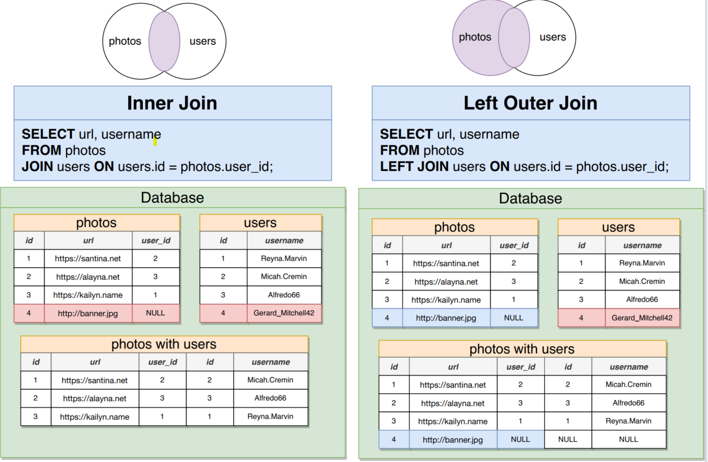
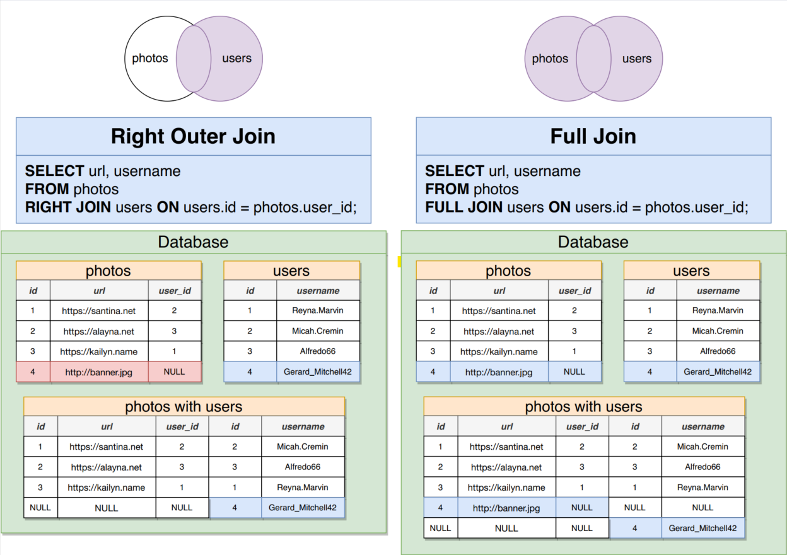

- Join Three tables 
```sql
SELECT * FROM USERS;

SELECT * FROM COMMENTS;

SELECT * FROM PHOTOS;

SELECT USERNAME,CONTENTS,URL
FROM COMMENTS
JOIN USERS ON USERS.ID = COMMENTS.USER_ID
JOIN PHOTOS ON USERS.ID = PHOTOS.USER_ID;
```
- Alternate forms of syntax 

```sql
--- join two tables
select comments.id, contents, url from comments
join photos on photos.id=comments.photo_id;

--- join tables and alias table column
select comments.id as comment_id, contents as story, url as "web site link"
from comments 
join photos on photos.id=comments.photo_id;

--- join three tables and alias table column
select username as "user Name", contents as story, url as "web site link"
from comments 
join photos on photos.id=comments.photo_id
join users on users.id=photos.user_id;

--- join three tables, alias table and table column
select c.id, username as "user Name", contents as story, url as "web site link"
from comments as c 
join photos on photos.id=c.photo_id
join users on users.id=photos.user_id;
```
- join Missing Data 
```sql
--- Insert Null Data in photos table 
insert into photos (url,user_id)
	values ('https://banana.jpg',null);

-- Count data in photos table 
select count (*) from photos;

-- join users table with photos 
select username,url from users
join photos on users.id=photos.user_id;         -- In this join null values is not showing 
```
#### Join Table cheatsheet
- Inner Join and outer Join 

- Right Outer join and Full join


- Example of Table Joinnig 
```sql
-- Inner Join 
SELECT
	USERNAME,
	URL
FROM
	PHOTOS
	JOIN USERS ON USERS.ID = PHOTOS.USER_ID;

-- Left Outer Join 
SELECT
	USERNAME,
	URL
FROM
	PHOTOS
	LEFT JOIN USERS ON USERS.ID = PHOTOS.USER_ID;

-- Right Outer Join
SELECT
	USERNAME,
	URL
FROM
	PHOTOS
	RIGHT JOIN USERS ON USERS.ID = PHOTOS.USER_ID;

-- Full Join
SELECT
	USERNAME,
	URL
FROM
	PHOTOS
	FULL JOIN USERS ON USERS.ID = PHOTOS.USER_ID;
```
- Left Join from different table 
```sql
-- Left join from photos table 
SELECT
	USERNAME,
	URL
FROM
	PHOTOS
	LEFT JOIN USERS ON USERS.ID = PHOTOS.USER_ID;

-- Left join from users table 
SELECT
	USERNAME,
	URL
FROM
	USERS
	LEFT JOIN PHOTOS ON USERS.ID = PHOTOS.USER_ID;

```
58